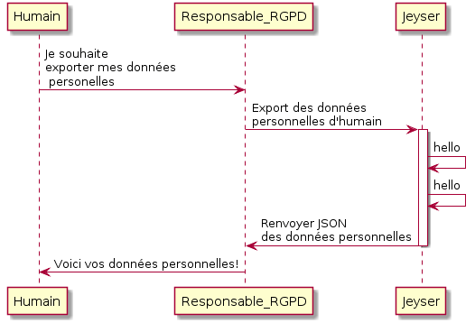

# Règlement général sur la protection des données

Le Règlement général sur la protection des données, RGPD en français, *aussi connu sous le nom de GDPR, General Data Protection Regulation*, constitue le nouveau texte de référence européen en matière de protection des données à caractère personnel. ll renforce et unifie la protection des données pour les individus au sein de l'Union européenne. [Wikipedia](https://fr.wikipedia.org/wiki/R%C3%A8glement_g%C3%A9n%C3%A9ral_sur_la_protection_des_donn%C3%A9es)

En tant que logiciel de gestion de données personnelles, Jeyser doit également respecter cette réglementation. 
Nous avons reçu récemment (12/2017) les directives de la CNJE concernant la GDPR et sommes au courant du besoin d'être en conformité à la date du 01/03/2018.

**Depuis le 18/02/2018 et la version 2.5.0, Jeyser permet l'application du RGPD.**

## Exigences

La GDPR requiert: 

1. que la junior soit dans la capacité de prouver qu'elle respecte les droits des personnes dont elle possède les données personnelles.

2. que la junior dispose d'une personne (le Président ou le Trésorier) responsable du traitement des données au sein de l'organisation (la junior). Ainsi si un client, un ancien de la Junior, un adhérent ou encore un prospect souhaite faire valoir ses droits, la Junior doit mettre en œuvre un processus clair et formalisé (acteur, délais) afin de respecter ces droits.

Ils sont au nombre de 5 :  
 
 * **Droit d’accès** : Une personne peut demander à la Junior si elle détient des informations sur elle, et demander à ce que la Junior lui communique l’intégralité de ces données. 
 * **Droit de rectification** : Une personne peut demander la rectification des informations inexactes qui le concernent. 
 * **Droit à l’effacement** : Une personne peut demander l’effacement de ses données personnelles dans les bases de données et les fichiers de la junior. 
 * **Droit d’opposition** : Une personne peut s’opposer, pour des motifs légitimes, à figurer dans un fichier de la Junior. Elle peut s’opposer à ce que les données qui la concernent soient diffusées, transmises ou conservées. 
 * **Droit à la portabilité** : Une personne peut récupérer les données qu’elle a communiquées à la Junior et les transmettre à une autre entité. 


3. que la junior dans le cas où une personne ferait valoir l'exercice d'un de ces droits, la junior doit y répondre dans un délai d'un mois et de manière gratuite. De plus, une fois la démarche effectuée, la junior doit le notifier par mail à la personne.

## Application

La partie de gestion des données personnelles est accessible uniquement aux membres dotés du role `ROLE_RGPD`. Pour respecter les consignes de la CNJE et l'esprit de la GDPR, nous vous conseillons de donner ce rôle à un nombre limité d'utilisateurs, responsables de l'application des exigences.

<br/>

<br/>

### Données personnelles

Jeyser stocke les données personnelles suivantes (sous réserve qu'elles aient été saisies):

**Membre** Un membre est un étudiant inscrit à la Junior-Entreprise.

 * Nom, Prenom, sexe
 * Coordonnées: Adresse, numéro de téléphone fixe et mobile
 * Date de convention Eleve
 * Email personnel et étudiant
 * Format de paiement de cotisation
 * Identifiant dans Jeyser
 * Lieu et date de naissance, Nationalité
 * Filière dans l'école
 * Numéro de sécurité sociale
 * Missions effectuées avec la junior-entreprise et leur détails: Rémunération, date de début et de fin
 * Compétences reconnues
 * Mandats effectués au sien de la junior
 
**Utilisateur** Un utilisateur est un utilisateur inscrit sur Jeyser et pouvant s'y connecter.

 * Nom d'utilisateur
 * Email
 * Date de dernière connexion
 * Date de dernière demande de mot de passe
 * Roles de l'utilisateur
 
**Employé** Un employé est une personne travaillant pour un prospect.

 * Nom, Prenom, sexe
 * Coordonnées: Adresse, numéro de téléphone fixe et mobile
 * Employeur
 * Poste

### Suppression des données

Les données personnelles sont supprimées dans la mesure du possible. Lorsqu'une personne (membre ou employé) a interagit avec la junior-entreprise, en signant des documents (RM, CC, AP ...), il n'est pas possible de supprimer ces données pour en garantir et respecter les contraintes légales.

Toutes les données personnelles non liées à la junior (email, coordonées, compétences ...) sont supprimées. 
Le nom et le prénom sont anonymisés en "M. a Nonyme", et les données liées à la junior (documents signés et dates de signatures) sont conservées.


### Export des données

Les données personnelles décrites ci-dessus peuvent être exportées en JSON.

Exemple pour un membre:

```json
{
   "prenom":"Paul",
   "nom":"Isaac",
   "sexe":"Monsieur",
   "mobile":"06 12 34 56 78",
   "fix":null,
   "email":"email@gmail.com",
   "emailEstValide":true,
   "estAbonneNewsletter":true,
   "employe":null,
   "membre":{
      "dateConventionEleve":{
         "date":"2018-11-18 00:00:00.000000",
         "timezone_type":3,
         "timezone":"UTC"
      },
      "identifiant":"PI1",
      "emailEMSE":"paul.isaac@etu.enseeiht.fr",
      "promotion":2018,
      "dateDeNaissance":{
         "date":"1997-07-05 00:00:00.000000",
         "timezone_type":3,
         "timezone":"UTC"
      },
      "lieuDeNaissance":null,
      "nationalite":"FR",
      "photoURI":null,
      "formatPaiement":"aucun",
      "securiteSociale":null,
      "filiere":"Info",
      "competences":[
         "PHP",
         "Symfony",
         "Ruby",
         "Auth. avanc\u00e9e"
      ],
      "mandats":[

      ],
      "mission":[
         {
            "doctype":{
               "version":1,
               "signataire1":"M. BEZOS Jeff",
               "signataire2":null,
               "dateSignature":"2017-12-14T00:00:00+0000"
            },
            "etude":"220THU",
            "debutOm":"2017-12-14T00:00:00+0000",
            "finOm":"2018-01-25T00:00:00+0000",
            "pourcentageJunior":0.4,
            "avancement":98,
            "nbrJEH":16,
            "remunerationBrute":3072
         }
      ]
   },
   "user":null,
   "adresse":{
      "adresse":"7 Avenue de Vincennes, Appartemnt 12",
      "codepostal":31000,
      "ville":"Toulouse",
      "pays":null
   }
}
```

## Avertissement

 * Si vous stockez des fichiers dans Jeyser, nous ne les analysons pas. Vous devrez donc les supprimer manuellement. 
 * De même si vous utilisez un espace de stockage en ligne (tel un cloud), la démarche et le process pour cet outil seront sous votre responsabilité.
 * Enfin, comme le rappelle la [licence de Jeyser](https://github.com/n7consulting/Incipio/blob/master/LICENSE), Jeyser est fourni sans garantie, et ne pourra pas être tenu responsable en cas de non-respect de la législation.
 
> THERE IS NO WARRANTY FOR THE PROGRAM, TO THE EXTENT PERMITTED BY
> APPLICABLE LAW.  EXCEPT WHEN OTHERWISE STATED IN WRITING THE COPYRIGHT
> HOLDERS AND/OR OTHER PARTIES PROVIDE THE PROGRAM "AS IS" WITHOUT WARRANTY
> OF ANY KIND, EITHER EXPRESSED OR IMPLIED, INCLUDING, BUT NOT LIMITED TO,
> THE IMPLIED WARRANTIES OF MERCHANTABILITY AND FITNESS FOR A PARTICULAR
> PURPOSE.  THE ENTIRE RISK AS TO THE QUALITY AND PERFORMANCE OF THE PROGRAM
> IS WITH YOU.  SHOULD THE PROGRAM PROVE DEFECTIVE, YOU ASSUME THE COST OF
> ALL NECESSARY SERVICING, REPAIR OR CORRECTION.
