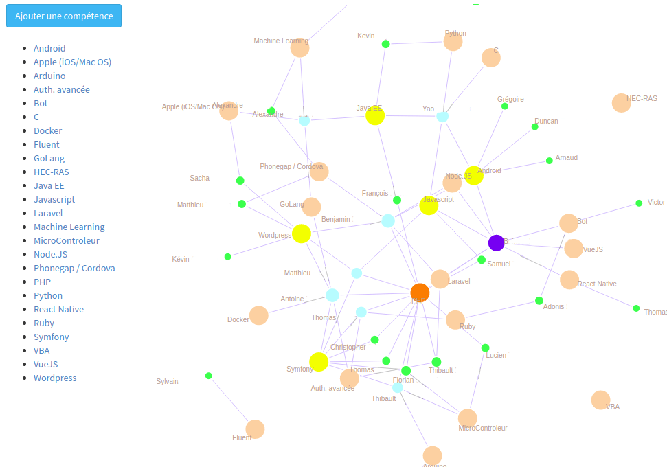

# Relations humaines

Le module RH permet d'établir un mapping entre vos membres et des compétences. Retrouvez facilement les membres ayant les compétences pour réaliser un nouveau projet.

<figure>
    
    <figcaption>Accueil du module RH avec la visualisation des compétences et des intervenants</figcaption>
</figure>
