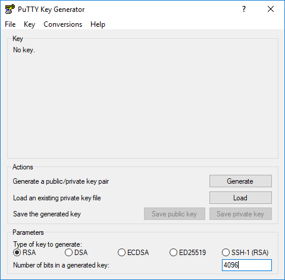
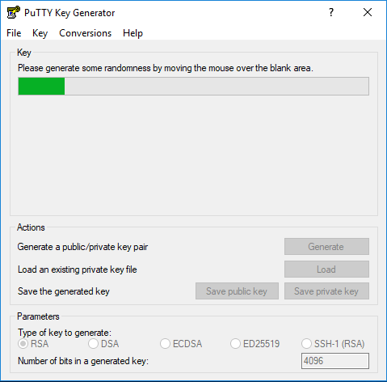
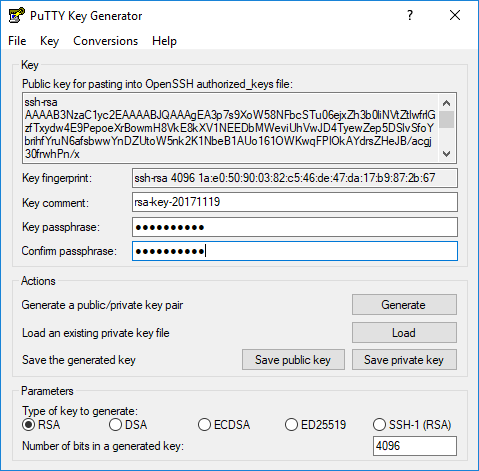
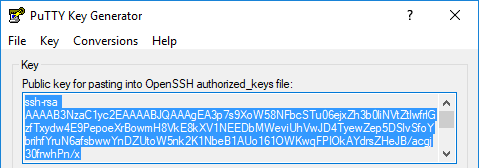
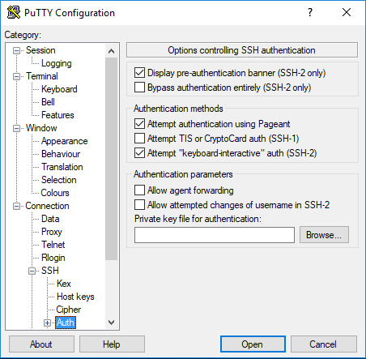
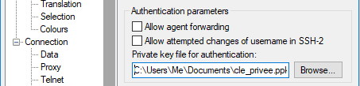
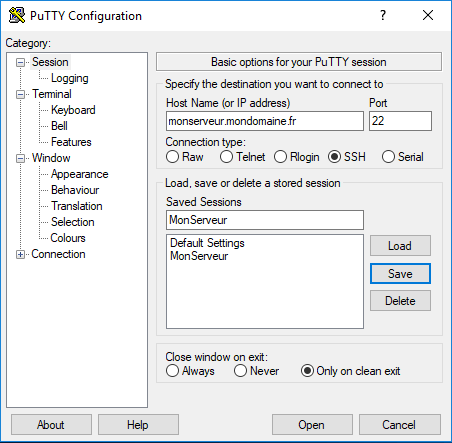

# Help for SSH connection

# SSH Key connection

Some of the providers don't allow connection with a password. Here is a guide on SSH key. 
Be warned that it's more difficult than user password authentication. On the other hand, it provides a better security
(as long as you don't loose the key).

That chapter is not a cryptography lesson. If you are interested in the background, 
please refer to [RSA encryption](https://fr.wikipedia.org/wiki/Chiffrement_RSA) and [Secure shell](https://fr.wikipedia.org/wiki/Secure_Shell)

## On Windows

If you need that authentication mode, the key creation process also uses Putty.

If you haven't already, [Download PuTTY](http://www.putty.org/), a SSH client for Windows.

Once Putty installed, launch Puttygen (provided with putty).

 - As for "Number of bits in a generated key", choose `4096`.

 - Your key requires a source of randomness to be secure. Click on "Generate" and move your mouse in the frame.

* You will the be asked a "Key passphrase", it is a password that will protect yout private key.

* Vous pouvez ensuite sélectionner successivement "Save public key" et "Save private key" pour enregistrer les clés dans vos documents respectivement sous les noms "cle_publique" et "cle_privee".

NOTE: Ces clés sont liées mais il n'est pas possible de retrouver l'autre si l'une est perdue.
Vous devriez les conserver ensemble. Faites attention de ne pas les perdre sinon il faudra en créer de nouvelles.

IMPORTANT: La clé privée ne doit être communiquée qu'aux personnes physiques que vous autorisez à se connecter à votre serveur.

Votre clé publique à saisir dans votre espace client *sur le site de votre hébergeur* se situe dans le cadre déroulant en haut de Putty et si besoin dans le fichier "cle_publique".

Vous pouvez à présent la copier, fermer PuTTYgen et démarrer PuTTY.

* Dans le menu à gauche, sélectionnez "Connection" puis "SSH" puis "Auth".

* Pour le champ "Private key file for authentication", cliquez sur "Browse" pour aller chercher le fichier "cle_privee".

* Dans le menu à gauche, revenez à "Session".
Entrez l'adresse IP de votre serveur (ou le nom de domaine si vous en avez acheté un), laissez le port 22 et la connection de type SSH.

Pour que toutes ces manipulations restent enregistrées dans Putty, vous pouvez donner un nom dans le champ "Saved Sessions" et cliquer sur "Save".

Tout est prêt, vous pouvez cliquer en bas sur "Open" pour vous connecter à votre serveur.

**Warning** If you loose the key, you might (depending on your provider) loose the access to your server.
