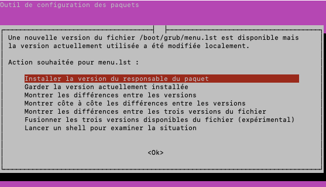

# Install Jeyser CRM in minutes !

Jeyser could be frightening to install. **It is not !** 
With only basics computer science knowledge and 5 commands, you can safely deploy it on your server, https included.

<br/>If you have no server management skills, please read [Environment page](environment) for some basics about it. 
Don't be afraid, it's easy.

## TL;DR

Server requirements: 1vCPU, 2Go RAM, 10 Go disk space.

Connect to your server and run the **Jeyser installation script**

```bash
   # Create a directory for jeyser
   mkdir -p /var/www
   cd /var/www
   # clone Jeyser code source
   git clone https://github.com/n7consulting/Incipio.git
   cd Incipio
   # get the latest release number on https://github.com/n7consulting/Incipio/releases
   git checkout v2.8.1
   # run the docker installer
   chmod u+x var/install/initial-setup_ubuntu16.sh
   ./var/install/initial-setup_ubuntu16.sh
```

For more details, read below.

## Server requirements

To run Jeyser you need a VPS (virtual private server) matching at least the following requirements : 

 - 1 vCPU
 - 2 GB of RAM
 - 10 Go of hard disk space
 
We strongly advocates for Ubuntu 18.04 (Ubuntu 16.04 is also supposed to work) as your server Operating System 
because our automatic install scripts are only tested on Ubuntu.

Such server cost between 3 and 7 euros per month.

 > At N7 Consulting we use an OVH VPS SSD1 at 3€/month and it works very well.
 
 In addition of your VPS, you will also need a subdomain pointing on your server ip. 
 More information in the [Environment](environment) setup guide.
 
## Install Jeyser using the Docker install

### Introduction

Docker is a virtualization software that isolates applications into containers. Don't panic if you don't understand that definition.
As for Jeyser, we use Docker to ship a standard environment.
 
<br/>Using the docker install has many benefits : Automatic install, automatic and free SSL certificate (https),
 already configured server and software. **It is the best for non tech people.** 
 
In the following steps, we assume that your server will be used to run only Jeyser. 
If it is not the case, please refer to the [FAQ](dev/faq)
 
We can't make installation easier than that. Feel free to [ask for help if you need some](./../../support).
 
### Install script

Once a subdomain is pointing on your server ip and you connected to your server:
 
 1. copy paste the lines of the Jeyser installation script (see above) in your console
 2. Answer the subdomain and contact email question
 3. In case of questions during installation (such as figure below) choose the first or second option and validate with "Enter"

<figure>
 
</figure>

That's all ! Jeyser is now installing itself. Don't be afraid, it can take some time. 
At the end of the installation process, if go to the [configured subdomain](environment) (first connection can take several seconds) 
you should have a working login page. 
Connect with the credentials `admin/admin` and don't forget to change them right after your first login.

