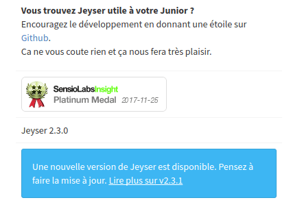
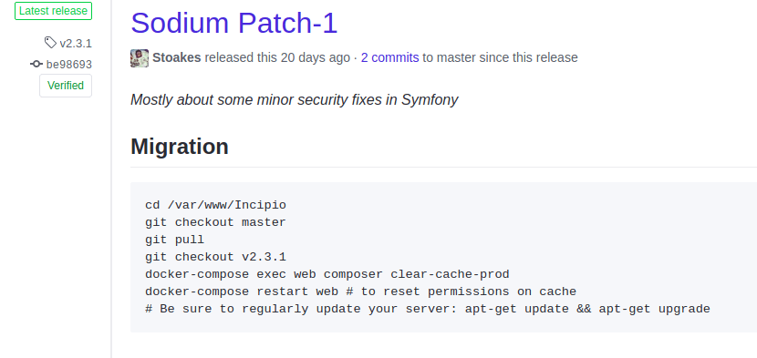

# Update Jeyser

Contrary to some commercial products, Jeyser has an active community and receives bug fix and improvements. 
Thus it has to be updated regularly.   

### Notifications are send when a new version is available

When an admin connects, Jeyser displays on the welcome page if a new update is available. Just click the link and follow the instructions. 

<figure>
    
    <figcaption>Notifications are displayed when a new version is available</figcaption>
</figure>

Our update instructions are targeted for the docker installation. Thus if you have installed Jeyser with Docker, just connect to your server 
and copy paste the migration script in your shell.

<figure>
    
    <figcaption>Just follow the update instructions. For instance here are the instructions to migrate from Jeyser 2.3.0 to 2.3.1</figcaption>
</figure>

**Beware** Don't copy paste the whole block of code. Do it line after line, otherwise it might not work 
(for instance if a command requires a validation or a manual input).
 

If you have a manual installation, the migration process is not much different, adapt . If you choosed the manual install, it should not be a big deal for you anyway.

### Update quickly

It's important to update as soon as possible, so as not to miss an update. 
Follow carefully the instructions. If you missed an update, don't try to update to the latest directly, do it version after version.

> Example:
>
> You are using Jeyser 2.2.0. Jeyser 2.2.1 is released but you miss it and when you want to update, Jeyser 2.3.0 is already out.
>
> ~~Don't~~: Follow the instructions to update from 2.2.1 to 2.3.0. It might not work and potentially break your Jeyser.
>
> **Do**: Follow the instructions to update from 2.2.0 to 2.2.1, and then follow those to update from 2.2.1 to 2.3.0

Remember, you are not alone, we are a community. If you have an issue with an update use the [support](/support). We will be glad to help you.

### Advanced: Semantic versionning

*This part targets advanced users, with some minimal development skills. If you are not, it might puzzle you.*

Jeyser follows [Semver](https://semver.org/). The conditions to tag a version are the following:

 - The update only requires to pull code from the repository and clear the cache. It will be tagged with a **patch**, such as `2.3.0 to 2.3.1`.
 
 
 - The update has some database migrations, bring changes to a Docker container or contains significant changes. 
   It will be tagged with a **minor**, such as `2.2.x to 2.3.0`.

 - The update makes significant changes on the code organisation, database schema or contains a new major version of Symfony. It will be tagged with a **major**, such as `1.11 to 2.0.0`
